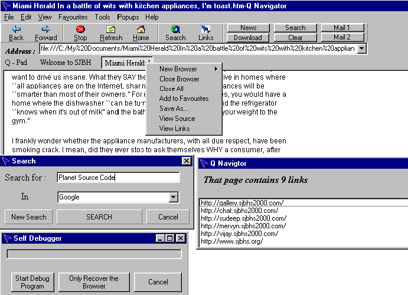



## Quick \(Q\) Navigator Ver 1\.1  \(Updated\): The BEST WEB BROWSER ever posted on PSC

### Description

(Now the links are working)

Q Navigator Ver 1.1 is an updated form of my Web Browser, which has the best features (and more) of all browsers.

a) Better GUI, b) Better looking progress bar, c) Auto complete address, d) Select all, e) Find, f) text size, g) scrolling news, h) source, i) better looking history & favorites, j) mail, k) update, l) internet options etc. etc.:

Other than ALL THE FUNCTIONS IN INTERNET EXPLORER,

1.You can store/jot down any required information while browsing,

2.It has a unique SEARCH facility where you can just give the word/sentence to search for and give the preferred search engine (you can choose to search from the best search engines!!!),

3.It has a "links" button that shows the number of links on the web page & the different links on the web page you are viewing,

4.Five configurable shortcut buttons: News, Download, Mail 1, Mail 2, Search, Easily configurable,

5.Scrolling News on the right top side when you are connected to the Internet, without losing any bandwidth

6.The best of all, this browser has a feature to backup and recover all such information when it crashes. When Q Navigator crashes (due to windows problems/software problems / etc.) Just go to Help > Help!!!

And run the debug program .You can either

Start debug program (in which it replaces corrupt resource files) or

Only recover the browser (in which it recovers the lost information / URL's), which is useful for retrieval of lost web pages after crash.

IMPORTANT: See "Readme.doc"
 
### More Info
 

             |
---                |---
**Submitted On**   |2001-01-03 22:12:06
**By**             |[QN](https://github.com/Planet-Source-Code/PSCIndex/blob/master/ByAuthor/qn.md)
**Level**          |Advanced
**User Rating**    |4.6 (216 globes from 47 users)
**Compatibility**  |VB 3\.0, VB 4\.0 \(16\-bit\), VB 4\.0 \(32\-bit\), VB 5\.0, VB 6\.0
**Category**       |[Internet/ HTML](https://github.com/Planet-Source-Code/PSCIndex/blob/master/ByCategory/internet-html__1-34.md)
**World**          |[Visual Basic](https://github.com/Planet-Source-Code/PSCIndex/blob/master/ByWorld/visual-basic.md)
**Archive File**   |[CODE\_UPLOAD13355142001\.zip](https://github.com/Planet-Source-Code/qn-quick-q-navigator-ver-1-1-updated-the-best-web-browser-ever-posted-on-psc__1-14108/archive/master.zip)

